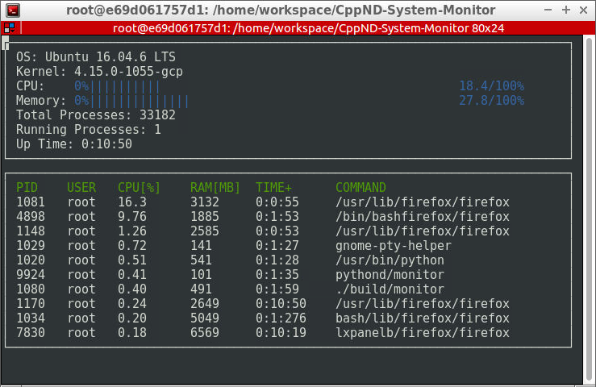

# CppND-System-Monitor

This program is an exploration of Object Oriented Programming with C++ as taught in the course [Udacity C++ Nanodegree Program](https://www.udacity.com/course/c-plus-plus-nanodegree--nd213).
The application tries to replicate the functions of [htop](https://github.com/hishamhm/htop), which is my favourite Linux System Monitoring tool. Along with C++, I also explore how the linux
system information are stored in the OS and how we can access and present them. 

## ncurses
[ncurses](https://www.gnu.org/software/ncurses/) is a library that facilitates text-based graphical output in the terminal. This project relies on ncurses for display output.

Install ncurses within your own Linux environment: `sudo apt install libncurses5-dev libncursesw5-dev`

## Make
This project uses [Make](https://www.gnu.org/software/make/). The Makefile has four targets:
* `build` compiles the source code and generates an executable
* `format` applies [ClangFormat](https://clang.llvm.org/docs/ClangFormat.html) to style the source code
* `debug` compiles the source code and generates an executable, including debugging symbols
* `clean` deletes the `build/` directory, including all of the build artifacts

## Instructions

1. Clone the project repository: `git clone https://github.com/thisisppn/Linux-System-Monitor.git`

2. Build the project: `make build`

3. Run the resulting executable: `./build/monitor`